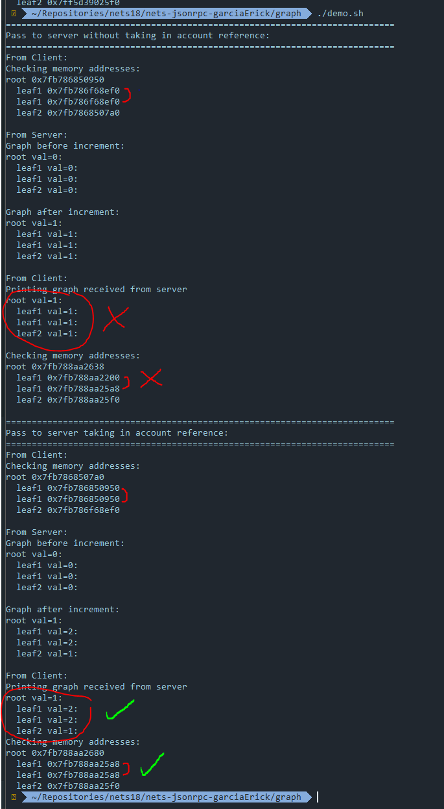

# nets-tcp-proxy

This repo contains a demo of jsonrpc sending a graph back and forth a client and a server. It explains the difference of taking in account references and not taking them into account as explained in the image bellow:

## How to run
To run this demo just execute the ./demo.sh
